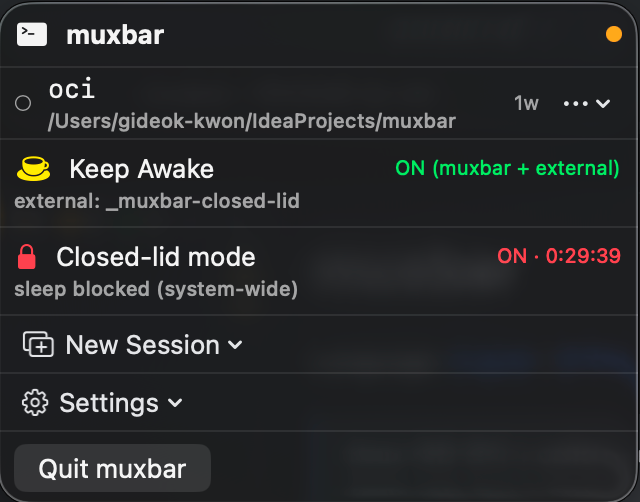

# muxbar

**Language:** [English](README.md) | [한국어](README.ko.md)

> tmux 세션 관리 + caffeinate 토글을 메뉴바에서. macOS 네이티브 앱.

**이런 용도로:** tmux 세션 매니저 · Keep Awake 토글 · **헤드리스 클램쉘** (closed-lid 모드 — 외부 디스플레이 없이도 덮개 닫고 작업 유지) · **장시간 실행 스크립트 런처** (OCI / 클라우드 용량 polling / 백업 / 배치 잡).

[](LICENSE)
[](https://www.apple.com/macos/)
[](https://swift.org)

<p align="center">
  
</p>

## 주요 기능

- **세션 리스트** — 활성 세션 전체를 메뉴바에서 확인. attached 우선, 그룹 내 생성일 최신순 정렬
- **Attach** — Terminal.app / iTerm2 / Warp / Alacritty / kitty 중 원하는 터미널에서 열기
- **Kill** — 메뉴에서 바로 세션 종료
- **라이브 프리뷰** — 세션 행 클릭 or "Preview" 로 최근 출력 미리보기 (SwiftTerm 으로 ANSI 렌더)
- **Keep Awake** — `caffeinate -dims` 를 `_muxbar-awake` 라는 tmux 세션으로 실행/토글. 외부에서 실행 중인 caffeinate (다른 tmux 세션이든 일반 프로세스든) 까지 감지하고 한 번에 종료.
- **Closed-lid mode (헤드리스 클램쉘)** — "외부 디스플레이 없이 동작하는 클램쉘" 토글. 덮개 닫고도 CPU 가 계속 돌아 빌드 / CI / 원격 세션이 가방 안 출퇴근을 견딤. 토글 → 30m/1h/4h/8h/∞ → 관리자 비밀번호 (Touch ID). 자동 해제: 타이머 / AC 분리 / lid 열림 / 종료 — 타이머 만료는 비밀번호 prompt 에 막히지 않음. 자세한 건 [Closed-lid mode](#closed-lid-mode-detailed) 섹션.
- **다국어 지원** — English + 한국어. Settings → 언어 에서 전환 (자동 / English / 한국어).
- **템플릿 / 스크립트 런처** — 빌트인 + 사용자 YAML 템플릿. 장시간 실행되는 스크립트(OCI 인스턴스 생성, 클라우드 용량 polling, 백업, 배치 잡)를 메뉴바 토글처럼 한 클릭으로 띄우고 detach/re-attach — 스크립트는 계속 돈다. [장시간 실행 스크립트 런처](#long-running-script-launcher) 섹션 참고.
- **전역 단축키** — `⌘⇧A` Keep Awake 토글, `⌘⇧1` ~ `⌘⇧9` 로 상단 N번째 세션 attach
- **Open at Login** — `.app` 번들로 설치된 경우 macOS Login Item 등록 (Settings 하위)

## 메뉴바 아이콘

- 세션 0개: 빈 커피잔
- 활성 세션: 커피잔 + 세션 수 뱃지
- Keep Awake 활성: 김 나오는 커피잔 + 오렌지 톤
- Closed-lid mode 활성: 빨간 lock 아이콘 (Keep Awake 보다 우선)

## 메뉴 구조

```
  ┌ ▣ muxbar                   ● ┐  ← 헤더 (이름 + 연결 상태 dot)
  ├──────────────────────────────┤
  │ ● api                1w  ⋯   │   ← attached (초록 dot)
  │    /Users                    │      cwd 는 서브텍스트
  ├──────────────────────────────┤
  │ ○ dev                2w  ⋯   │   ← detached
  │    /Users/kgd/msa            │
  ├──────────────────────────────┤
  │ ○ logs               1w  ⋯   │
  │    /var/log                  │
  ├──────────────────────────────┤
  │ ☕  Keep Awake          ON    │   ← 토글 (⌘⇧A)
  ├──────────────────────────────┤
  │ 🔒  Closed-lid mode     OFF  │   ← lid 닫고도 sleep 차단
  ├──────────────────────────────┤
  │ ⊞  New Session          ▸    │   ← 템플릿 서브메뉴
  ├──────────────────────────────┤
  │ ⚙  Settings             ▸    │   ← Open at Login 등
  ├──────────────────────────────┤
  │    Quit muxbar          ⌘Q   │
  └──────────────────────────────┘
```

- 세션 행은 attached(●) 먼저, 그다음 detached(○) — 각 그룹 내 최신순
- 5개 초과하면 리스트 내부 스크롤
- 행 우측 `⋯` 를 누르면 액션 메뉴 (Attach / Preview / Kill)
- 세션 이름 자체를 누르면 라이브 프리뷰 팝오버가 열림

<a id="closed-lid-mode-detailed"></a>
## Closed-lid mode

MacBook 덮개를 닫고도 시스템 sleep 없이 백그라운드 작업을 진행하게 하는 토글.

### 사용 시나리오

- 출퇴근/이동 중에도 계속 돌려야 하는 빌드 · 테스트 · CI 작업
- 가방 안에서 끊기지 않아야 하는 SSH 세션
- 외부 모니터 없이 밤새 돌릴 watcher / poller / 데이터 수집 스크립트

### 동작 원리

두 레이어를 결합해서 lid 닫혀도 실제로 시스템이 깨어있게:

| 레이어 | 효과 |
|---|---|
| `pmset -a disablesleep 1` (커널 레벨) | lid 닫힘 → 강제 sleep 경로 차단 |
| `_muxbar-closed-lid` tmux 세션의 `caffeinate -is` | idle + system IOPM assertion 으로 보강 |

디스플레이는 의도적으로 켜두지 않습니다 (`-d` 빼둠). lid 가 닫힌 상태라 어차피 lid 센서가 internal display 를 hardware 레벨로 끄고 — 가방 모드 워크로드에 정확히 부합.

### 자동 해제 (4 트리거)

| 트리거 | 이유 |
|---|---|
| ⏱ 타이머 만료 | 토글 시 선택한 기간 |
| 🔌 AC 어댑터 **분리** (transition 만) | 배터리 급감 방지. 이미 배터리 모드일 때 토글한 경우엔 발화 안 함 — 가방 사용 시나리오 보호. |
| 💻 lid 열림 | 사용자가 돌아왔으니 일반 sleep 정책 복귀 |
| 🚪 muxbar 종료 | `applicationShouldTerminate` 가 `pmset` 복원 끝날 때까지 대기 후 종료 |

**수동 OFF**: 사용자가 admin 비밀번호 prompt 를 cancel 하면 state 는 ON 유지 + AC/lid monitor 재무장 — zombie 상태 안 남음.

**자동 해제 (타이머 / AC / lid)**: 비밀번호 dialog 를 띄우지 않음. `sudo -n pmset` 으로 silent 시도 — 아래 NOPASSWD 룰이 설정돼 있으면 통과, 미설정이면 caffeinate 세션 kill + state OFF + "메뉴에서 OFF 토글로 pmset 복원 다시 시도" 알림 발송. **"N분 뒤 자동 종료" 약속은 비밀번호 입력 없이도 무조건 지켜짐.**

### macOS 정식 클램쉘 모드와 비교

기능적으로 유사 — 둘 다 lid 닫힌 상태에서 CPU 를 깨워 둠 — 하지만 발동 조건과 의도가 다름. Closed-lid mode 는 사실상 **외부 디스플레이 없이 동작하는 헤드리스 클램쉘** (`caffeinate -is` + `pmset disablesleep 1`) 이라, 노트북을 가방에 넣은 채로도 / AC 만 연결한 채로도 작업이 살아남음.

| | macOS 클램쉘 모드 (Apple) | Closed-lid mode |
|---|---|---|
| 발동 | AC + 외부 디스플레이 + 외부 입력 모두 연결 시 자동 | 수동 토글 |
| 외부 디스플레이 | **필요** | 불필요 |
| lid 닫힘 시 화면 | 외부 모니터로 출력 | 외부 디스플레이 없으면 꺼짐; **있으면 자동으로 외부 모니터로 출력** |
| AC 필수 | **필수** | 불필요 |
| 외부 키보드/마우스 필수 | **필수** | 불필요 |
| lid 닫힘 시 CPU | 동작 | 동작 |
| 자동 해제 | lid 열림 / 외부 디스플레이 분리 | 타이머 / AC 분리 / lid 열림 |

**보너스 — closed-lid mode 는 Apple 클램쉘의 상위 호환.** closed-lid mode 가 켜진 상태에서 외부 디스플레이를 꽂으면 macOS 가 알아서 거기로 출력 라우팅 — Apple 정식 clamshell 과 동일한 "데스크 모드" 가 되는데, **AC / 외부 키보드 / 외부 마우스 조건이 모두 필요 없음**. 같은 토글 하나로 *가방 모드*(헤드리스, 배터리도 OK) + *데스크 모드*(외부 모니터만 있으면 됨) 둘 다 커버.

Apple 의 클램쉘 모드는 "데스크에 거치된 노트북 + 풀세트 주변기기" 용. Closed-lid mode 는 "가방 안 노트북" 이거나 "HDMI 케이블 하나만 꽂은 데스크" 용.

### 비용 / 설정

- Apple Developer Program 불필요 — `sudo pmset` 을 AppleScript admin prompt 로 호출
- helper daemon / kernel extension 없음
- macOS 가 admin 비밀번호를 약 5분간 캐시하므로 ON → OFF → 다시 ON 같은 빠른 반복 조작은 prompt 한 번으로 충분

### 비밀번호 없이 사용 (선택)

타이머 만료 / 자동 해제 / 5분 캐시 만료 후 OFF 등 모든 상황에서 비밀번호 prompt 없이 동작하게 하려면 `sudoers` 에 `pmset` 만 NOPASSWD 룰로 등록:

```bash
echo "$(whoami) ALL = (root) NOPASSWD: /usr/bin/pmset" | sudo tee /etc/sudoers.d/muxbar > /dev/null
sudo chmod 440 /etc/sudoers.d/muxbar
```

muxbar 가 먼저 `sudo -n pmset` 을 시도 → 룰이 있으면 prompt 없이 통과. 수동 OFF 의 경우 룰 미설정이면 AppleScript admin 다이얼로그로 fallback. 자동 트리거(타이머/AC/lid)는 dialog 안 띄우고 caffeinate 만 정리 + 알림 발송 → 사용자가 알아서 다음 메뉴 토글에서 복원.

해제: `sudo rm /etc/sudoers.d/muxbar`.

보안 범위: `pmset` (system sleep 정책) 한 명령만 비밀번호 없이 허용. 파일시스템 / 네트워크 / 프로세스 / 사용자 권한 영향 없음.

<a id="long-running-script-launcher"></a>
## 장시간 실행 스크립트 런처

tmux 세션을 "한 번 토글하면 계속 도는 작업" 슬롯처럼 활용. polling, 배치 잡, 인프라 대기 작업을 별도 터미널 창 띄워두지 않고, 쉘 프롬프트 안에서 살 필요 없이 메뉴바에서 관리.

### 어디서 진가가 나오나

- **OCI / 클라우드 인스턴스 생성** — `oci compute instance launch ...` 처럼 용량 확보될 때까지 polling 하는 스크립트. 몇 시간씩 돌릴 거 터미널 지키고 있지 않아도 됨.
- **용량 polling** — AWS Spot / GCP preemptible / Vast.ai 등 목표 가격에 자원 잡힐 때까지 반복 시도.
- **장시간 백업 / 데이터 동기화** — `rsync`, `restic`, `aws s3 sync` 로 대용량 데이터 처리. 시작만 시키고 detach.
- **배치 잡** — 야간 DB 마이그레이션, 대규모 `terraform apply`, 개인 머신에서 돌리는 학습 루프.
- **로컬 watcher / poller** — `gh run watch`, `kubectl logs -f`, 터미널 닫혀도 살아있어야 하는 반복 스크립트.

### 사용 방법

1. YAML 템플릿을 `~/Library/Application Support/muxbar/Templates/` 에 둠:

```yaml
name: OCI Create
description: Oracle Cloud 인스턴스 생성 (용량 생길 때까지 polling)
sessionNameHint: oci
windows:
  - name: create
    command: ~/oci-create-instance.sh; exec $SHELL
```

2. 메뉴바에서 **New Session → OCI Create**. 세션이 즉시 떠서 메뉴바 아이콘에 세션 카운트가 +1.
3. `⌘⇧1`-`⌘⇧9` 로 터미널에 attach, 또는 행을 클릭해 라이브 프리뷰. `⌃b d` 로 detach — 스크립트는 계속 돈다.
4. **Closed-lid mode** 와 같이 켜면 노트북을 가방에 넣고 출퇴근하는 동안 스크립트가 알아서 끝남.

`; exec $SHELL` 꼬리표는 스크립트가 끝나거나 Ctrl+C 로 중단됐을 때 인터랙티브 셸로 떨어지게 해서 출력을 보존 — window 가 닫혀버려서 결과 못 보는 사고 방지.

YAML 스키마 상세는 [사용자 템플릿](#사용자-템플릿) 섹션 참고.

## 요구사항

- macOS 13 (Ventura) 이상
- `tmux` — `brew install tmux`
- Xcode Command Line Tools — 아직 없다면 `xcode-select --install`

## 빠른 시작

한 덩이로 복사해 실행:

```bash
git clone https://github.com/1989v/muxbar.git
cd muxbar
./build.sh install
open /Applications/muxbar.app
```

이걸로 끝. 메뉴바에 커피잔 아이콘이 뜨고, 클릭하면 tmux 세션 리스트가 보입니다.

## 설치 옵션

### 1. 소스에서 직접 빌드 (현재 기본 경로)

Xcode 없이 Command Line Tools 만으로 됩니다.

```bash
git clone https://github.com/1989v/muxbar.git
cd muxbar

./build.sh           # Release 빌드 + .app 번들 (./muxbar.app 생성)
./build.sh open      # 빌드 + 레포 디렉터리에서 바로 실행
./build.sh install   # 빌드 + /Applications 로 복사
```

`build.sh` 가 하는 일:
1. `swift build -c release`
2. 바이너리를 `muxbar.app/Contents/{MacOS, Info.plist}` 구조로 래핑
3. `codesign --sign -` 로 ad-hoc 서명 (Apple Developer 계정 불필요)
4. quarantine 속성 제거 → Gatekeeper 경고 없이 첫 실행 가능

### 2. Homebrew cask *(배포 후 제공 예정)*

첫 릴리스가 나오면 아래 명령으로:

```bash
brew install --cask 1989v/tap/muxbar
```

### 3. 미리 빌드된 `.dmg` *(배포 후 제공 예정)*

각 [GitHub Release](https://github.com/1989v/muxbar/releases) 에 ad-hoc 서명된 `.dmg` 를 첨부할 계획. 첫 실행 시 우클릭 → 열기 로 Gatekeeper 통과 (notarize 는 안 됨).

## 개발

소스에서 바로 실행 (일부 기능은 unbundled 모드에서 제한됨 — 아래 표 참조):

```bash
swift build
swift run muxbar
```

테스트 (XCTest 프레임워크 필요, Xcode 설치 시):

```bash
swift test
```

## 실행 모드별 기능 차이

| 기능 | `swift run` (unbundled) | `.app` 번들 |
|---|---|---|
| 세션 리스트 / Attach / Kill / Preview | ✅ | ✅ |
| Keep Awake / 템플릿 / 단축키 | ✅ | ✅ |
| Open at Login | ⚠ (Settings 에 표시만, 비활성) | ✅ |
| 시스템 알림 | ❌ | ✅ |

`.app` 번들이 필요한 기능 (Open at Login, 알림) 은 unbundled 실행 시 자연스럽게 비활성 처리됨 — 메뉴에서는 항목이 보이되 토글이 잠겨 있음.

## 키보드 단축키

| 단축키 | 동작 |
|---|---|
| `⌘⇧A` | Keep Awake 토글 |
| `⌘⇧1` ~ `⌘⇧9` | 메뉴상 N번째 세션 attach |

## 사용자 템플릿

YAML 파일을 `~/Library/Application Support/muxbar/Templates/` 에 두면 됨:

```yaml
name: MyDev
description: My dev setup
sessionNameHint: mydev
windows:
  - name: edit
    command: nvim .
    cwd: ~
  - name: run
    command: npm run dev
  - name: logs
    command: tail -f logs/app.log
```

- 파일명이 `_` 로 시작하면 로더가 무시 (`_example.yaml` 같은 참고용 파일 용도)
- 메뉴에서 reload: **New Session → Reload Templates**
- 폴더 열기: **New Session → Edit Templates…**
- 실제 활용 예시(OCI polling, 용량 대기, 백업)는 위 [장시간 실행 스크립트 런처](#long-running-script-launcher) 섹션 참고.

## 설계 & 문서

- [v0.1 디자인 스펙](docs/specs/2026-04-17-v0.1-design.md)
- [구현 플랜](docs/README.md)
- [아키텍처 결정 기록 (ADRs)](docs/adr)

## 라이선스

[MIT](LICENSE) © 2026 kgd
