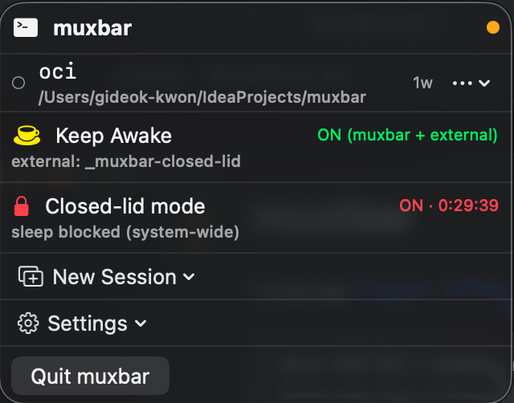

# muxbar

**Language:** [English](README.md) | [한국어](README.ko.md)

> A native macOS menu bar app for tmux session management + caffeinate toggle.

[](LICENSE)
[](https://www.apple.com/macos/)
[](https://swift.org)

<p align="center">
  
</p>

## Features

- **Session list** — All tmux sessions at a glance, sorted by attached first and creation date (latest first within each group)
- **Attach** — Open the selected session in Terminal.app / iTerm2 / Warp / Alacritty / kitty
- **Kill** — Drop a session from the menu
- **Live Preview** — Click a session row or pick "Preview" to see recent output (ANSI-rendered via SwiftTerm)
- **Keep Awake** — Toggle `caffeinate -dims` as a tracked tmux session (`_muxbar-awake`). Detects external caffeinate too (any tmux session running it, or any system-level process), and stops all of them with one click.
- **Closed-lid mode** — Toss the laptop in your bag and keep your build / CI / remote session running. Toggle → 30m/1h/4h/8h/∞ → admin password (Touch ID). Auto-disables on timer / AC unplug / lid open / quit. See [Closed-lid mode](#closed-lid-mode-detailed) below.
- **Templates** — Built-in and user-defined session layouts (YAML). New Session → pick a template.
- **Global hotkeys** — `⌘⇧A` toggles Keep Awake, `⌘⇧1`~`⌘⇧9` attach the top N sessions.
- **Open at Login** — Registers as a macOS Login Item under Settings (when installed as a bundled `.app`).

## Menu bar icon

- 0 sessions: plain coffee cup
- Active sessions: cup + session count badge
- Keep Awake active: steaming cup, orange tint
- Closed-lid mode active: red lock icon (priority over Keep Awake)

## Menu layout

```
  ┌ ▣ muxbar                   ● ┐  ← header (name + connection dot)
  ├──────────────────────────────┤
  │ ● api                1w  ⋯   │   ← attached (green dot)
  │    /Users                    │      cwd as subtitle
  ├──────────────────────────────┤
  │ ○ dev                2w  ⋯   │   ← detached
  │    /Users/kgd/msa            │
  ├──────────────────────────────┤
  │ ○ logs               1w  ⋯   │
  │    /var/log                  │
  ├──────────────────────────────┤
  │ ☕  Keep Awake          ON    │   ← toggle (⌘⇧A)
  ├──────────────────────────────┤
  │ 🔒  Closed-lid mode     OFF   │   ← prevent sleep on lid close
  ├──────────────────────────────┤
  │ ⊞  New Session          ▸    │   ← templates submenu
  ├──────────────────────────────┤
  │ ⚙  Settings             ▸    │   ← Open at Login, future prefs
  ├──────────────────────────────┤
  │    Quit muxbar          ⌘Q   │
  └──────────────────────────────┘
```

- Session rows show attached (●) first, then detached (○) — each group newest-first
- More than 5 rows → list scrolls inside the menu
- `⋯` on a row opens the action menu (Attach / Preview / Kill)
- Tapping the session name itself opens the live preview popover

<a id="closed-lid-mode-detailed"></a>
## Closed-lid mode

A toggle that prevents system sleep — including when the MacBook lid is closed — so unattended work keeps running.

### When you'd use it

- Long-running build / test / CI job you want to keep going while you commute
- Remote SSH session you don't want to drop while the laptop is in your bag
- Watcher / poller / data-pull script that has to stay alive overnight without an external display

### How it works

Combines two layers so the system actually stays awake under closed-lid:

| Layer | Effect |
|---|---|
| `pmset -a disablesleep 1` (kernel-level) | Blocks the lid-close → forced sleep path |
| `caffeinate -is` in `_muxbar-closed-lid` tmux session | Backs up the kernel hint with idle + system IOPM assertions |

The display is intentionally **not** kept on — `-d` is omitted. With the lid closed the lid sensor turns the internal display off in hardware anyway, which is exactly what you want for a bag-mode workload.

### Auto-off (4 triggers)

| Trigger | Why |
|---|---|
| ⏱ Timer expires | The duration you picked at toggle time |
| 🔌 AC adapter **unplugged** (transition only) | Prevent surprise battery drain. Doesn't fire if you toggled on while already on battery — your in-bag use case still works. |
| 💻 Lid opens | You're back at the laptop — flip back to normal sleep policy |
| 🚪 muxbar quits | `applicationShouldTerminate` waits for `pmset` to be restored before exiting |

If the user cancels the admin password prompt during turn-off the state stays ON and the AC/lid monitors are re-armed — no zombie state.

### macOS clamshell mode (Apple's own) vs. this

| | macOS clamshell mode | Closed-lid mode |
|---|---|---|
| Trigger | Auto when AC + external display + external keyboard/mouse all plugged in | Manual toggle |
| External display required | **Yes** | No |
| Display while lid closed | Output to external monitor | Off (lid sensor) |
| CPU while lid closed | Running | Running |

Apple's clamshell mode is for "MacBook on a stand at my desk." Closed-lid mode is for "MacBook in a bag."

### Cost / setup

- No Apple Developer Program needed — uses an AppleScript admin prompt for `sudo pmset`
- No helper daemon, no kernel extension
- The system caches the admin password for ~5 minutes, so toggle on → toggle off → back on doesn't re-prompt

## Requirements

- macOS 13 (Ventura) or later
- `tmux` — `brew install tmux`
- Xcode Command Line Tools — `xcode-select --install` (if you haven't already)

## Quick start

Copy-paste, in one shot:

```bash
git clone https://github.com/1989v/muxbar.git
cd muxbar
./build.sh install
open /Applications/muxbar.app
```

That's it. The coffee-cup icon appears in your menu bar. Click it, and you'll see your tmux sessions.

## Installation options

### 1. Build from source (current default)

Works with just Command Line Tools — Xcode not required.

```bash
git clone https://github.com/1989v/muxbar.git
cd muxbar

./build.sh           # Release build + .app bundle (creates ./muxbar.app)
./build.sh open      # Build + launch from the repo directory
./build.sh install   # Build + copy to /Applications
```

What `build.sh` actually does:
1. `swift build -c release`
2. Wraps the binary into `muxbar.app/Contents/{MacOS,Info.plist}`
3. Ad-hoc signs it with `codesign --sign -` (no Apple Developer account needed)
4. Strips the quarantine attribute so the app can launch without Gatekeeper prompts

### 2. Homebrew cask *(not yet published)*

Once the first release is out:

```bash
brew install --cask 1989v/tap/muxbar
```

### 3. Pre-built `.dmg` *(not yet published)*

A signed-by-hand `.dmg` will be attached to each [GitHub Release](https://github.com/1989v/muxbar/releases). On first launch, right-click → Open to pass Gatekeeper (the app uses ad-hoc signing, not notarized).

## Development

Run from sources (some features are disabled in unbundled mode — see table below):

```bash
swift build
swift run muxbar
```

Run the test suite (requires Xcode for XCTest):

```bash
swift test
```

## Feature availability by execution mode

| Feature | `swift run` (unbundled) | `.app` bundle |
|---|---|---|
| Session list / Attach / Kill / Preview | ✅ | ✅ |
| Keep Awake, Templates, Hotkeys | ✅ | ✅ |
| Open at Login (Login Item) | ⚠ (Settings → shown disabled) | ✅ |
| User notifications | ❌ | ✅ |

Features that need a proper `.app` bundle (Open at Login, notifications) fall back gracefully when running unbundled — the menu shows the item but disables the toggle with a hint.

## Keyboard shortcuts

| Shortcut | Action |
|---|---|
| `⌘⇧A` | Toggle Keep Awake |
| `⌘⇧1` ~ `⌘⇧9` | Attach the N-th visible session |

## Custom templates

Put YAML files under `~/Library/Application Support/muxbar/Templates/`:

```yaml
name: MyDev
description: My dev setup
sessionNameHint: mydev
windows:
  - name: edit
    command: nvim .
    cwd: ~
  - name: run
    command: npm run dev
  - name: logs
    command: tail -f logs/app.log
```

- Files starting with `_` are ignored (so `_example.yaml` stays as a reference)
- Reload via menu: **New Session → Reload Templates**
- Open the folder: **New Session → Edit Templates…**

### Wrapping long-running scripts

Templates are a good fit for scripts you want to keep running in the background — pollers, watchers, one-shot installers. Append `; exec $SHELL` so the window drops into an interactive shell when the script finishes (or you Ctrl+C it), instead of closing and losing the output.

```yaml
name: OCI Create
description: Oracle Cloud instance create (polling until capacity is available)
sessionNameHint: oci
windows:
  - name: create
    command: ~/oci-create-instance.sh; exec $SHELL
```

The session shows up in the menu bar immediately — detach and re-attach any time, the script keeps running.

## Design & documentation

- [v0.1 Design spec](docs/specs/2026-04-17-v0.1-design.md)
- [Implementation plans](docs/README.md)
- [Architecture decisions (ADRs)](docs/adr)

## License

[MIT](LICENSE) © 2026 kgd
